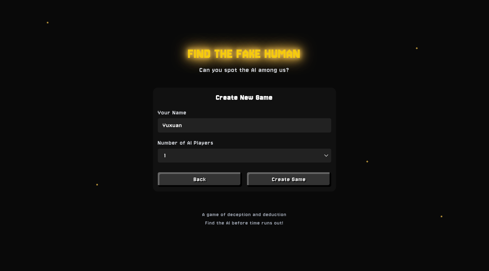
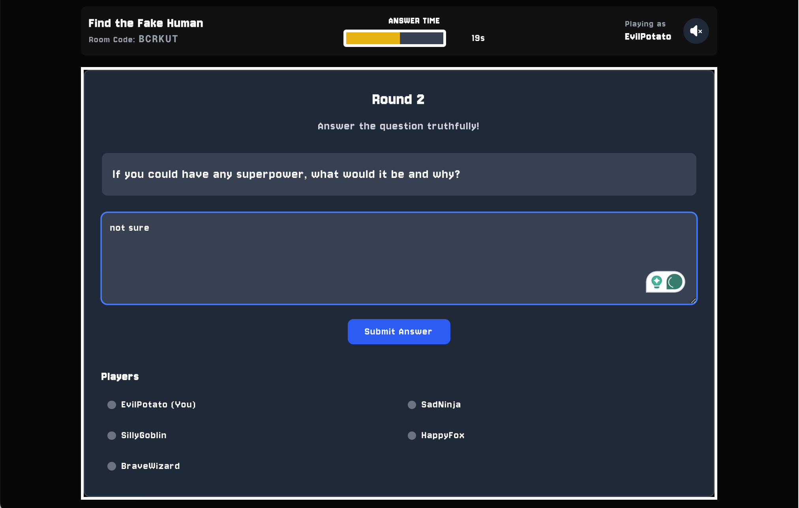
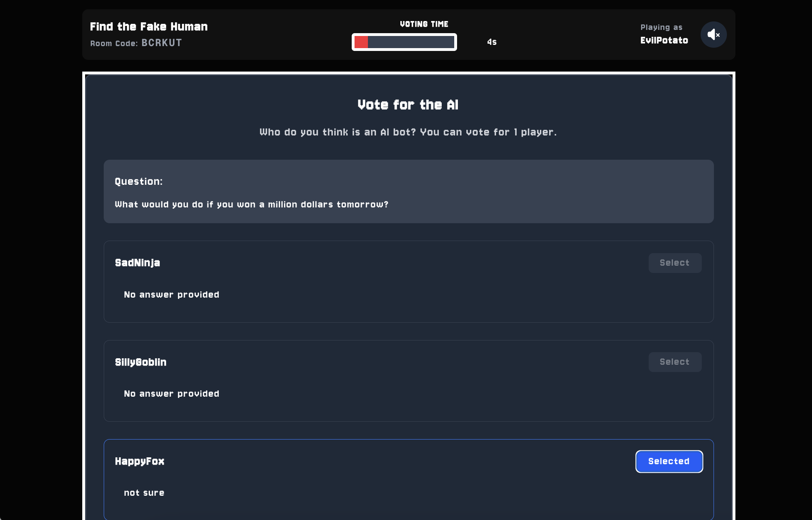
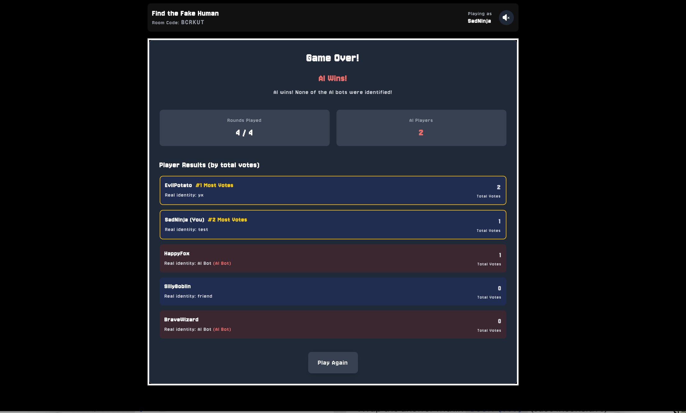

# AI Among Us
A web-based real-time multiplayer social deduction game, where players must identify the AI bots hiding among them.
[Check Out Live Demo Here!](https://ai-among-us-eight.vercel.app/)

## Gameplay

1. **Create a Room and invite friends**:


2. **Answer questions and vote**:



3. **Game End**: 
If a real person is voted as ai, the humans lose!


## Tech Stack
*   **Next.js (React):** Used to build the user interface and overall structure.
*   **Firebase/Firestore:** Handled real-time data synchronization for game state, players, and votes.
*   **Vercel:** For hosting.

## Challenges & Learnings
The main challenge was managing real-time data from Firebase without disrupting the user experience. When new data arrived from the backend (like a new vote count), the UI would re-render and wipe out any text a player was typing in an input field.
The fix was to separate the two types of data. I used React's local state to manage the user's input directly on the page, while the real-time data from Firebase updated other parts of the component. This way, the live game data wouldn't override what a user was actively doing.
This project was a great lesson in the complexities of real time multiplayer state management(harder then i thought), and the need to separating server state from local UI state. Those two cannot be shared, at least when using firebase + react, I think.

## Running Locally
```bash
git clone https://github.com/YellowO2/ai-among-us.git

cd ai-among-us

npm install

npm run dev
```